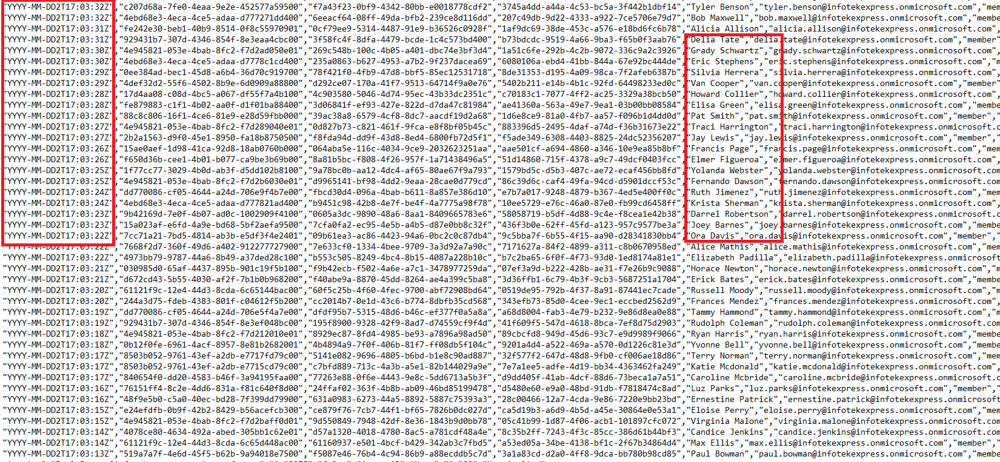
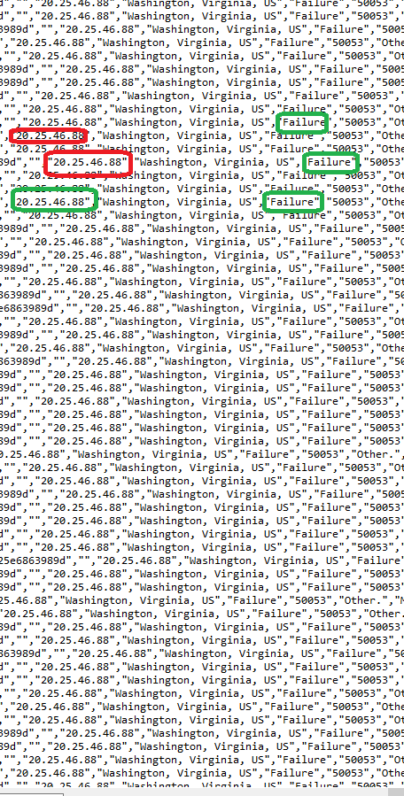

# Azure login activity logs

[*Download the log file to follow along*](./logs/InteractiveSignIns_Domain_spray_logs.csv)

In this walkthrough we will be taking a look at a log file that was pulled from Azure. [Azure](https://azure.microsoft.com/en-us) is a service provided by Microsoft to move a Domain into the cloud. While we know the Domain Controller records logins if the user used azure, we need to pull logs to see those attempts. The Azure log file, logs failed, attempted, and successful logins.

Our goal is to find how attackers may have initially accessed our domain network.

When we first crack open our log file in notepad we notice a few things, This log file logs IP addresses which is useful for us trying to identify who is logging into what account, it supplies the time stamp, and the account attempting to be accessed as well as the method of being accessed. With this in mind lets continue or investigation.

After scrolling down for a bit the first thing to notice is the amount of logins all within the same seconds of eachother, the chances of every employee attempting to login at the same exact time are impossible. We are beginning to get a picture of what may be happening. This indicates someone is trying to bruteforce login credentials.

Lets check and see the IP addresses, if theyre all the same IP that can give us an indication that either one person is trying to login to all of these accounts or, that all the employees are logging in from the same network(possible, not probable).

All of these logins that are within a few seconds of eachother come from the same exact IP, and if you look closer, you can see that almost all attempts are failed. This is not good, someone was doing a [bruteforce spray attack](https://owasp.org/www-community/attacks/Password_Spraying_Attack) at our domain. But theres nothing to worry about as long as no user got compromised right? So lets go through the logs and make sure all attempts are failed before we escalate this incident.

Thats not good, it looks like Paul Bowmans password was discovered by an attacker during this domain spray, but did the attacker realise that the password was correct and log in? Lets look above all the attempted logins for any activity from Paul Bowman.

It looks like the attacker found his way in to the domain through Paul Bowman. We can see the success message from a login attempt to the domain.
