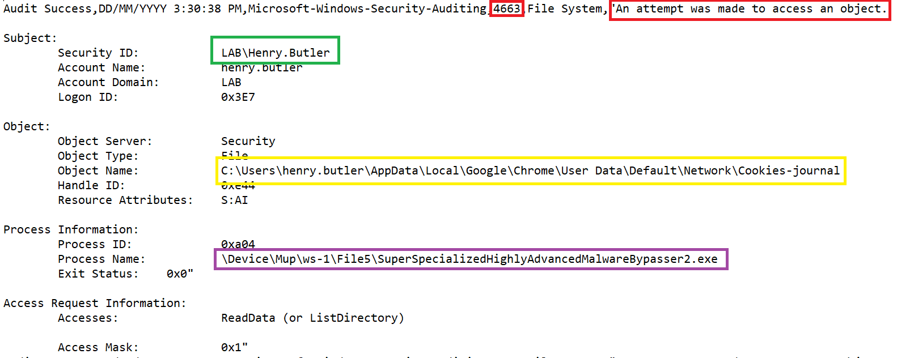

# Cookie Theft and RMM Takeover

[*Download the log file to follow along*](./logs/cookie_theft.csv)

At this point we know that the attacker is trying to pivot in the network. 

If the attacker got another user to run a malicious file, what will they do next? Well, this user was a slightly more privelleged user and may have access to things an attacker may want. 

Let's take the security logs from the workstation that Paul Bowman Pivoted too and see if we can see what the malicious executable is doing. If the attacker is running commands and scripts to acccess sensitive information our audit logs should contain evidence of what happened.

The Audit number that indicates something has attempted to access an object is `4663` So, `ctrl + f` and type "4663" and tab through, if the attacker did access a sensitive file it'll have the proccess name of `SuperSpecializedHighlyAdvancedMalwareBypasser2.exe`

We have found a very important Audit event,

**RED**: Contains Process 4663 and the text "An attempt was made to access an object" <-- This indicates that something has tried to access something but we need more information to go off of to get the full story. 

**GEEN**: Contains the username henry.butler <-- We know already that henry.butler was the next user to get compromised.

**YELLOW**: This shows the directory accessed, It looks like something has accessed the cookies of Google Chrome, the only program that should do that is Chrome itself. If another program has accessed it we know that the users cookies have been stolen.

**PURPLE**: Shows which program accessed the folder and files. It looks like SuperSpecializedHighlyAdvancedMalwareBypasser2.exe is the culprit. This is not good, the attacker has just stolen the cookies for henry.butler who we know has access to our RMM.

It looks like the attacker is dumping the users cookies to gain access to accounts on the web. Does this user have access to any important accounts or frameworks? Yes, this user has access toa RMM that manages the domain. If an attacker gains access to the RMM, all of our computers may get taken over.

Not to worry though right? Most RMM use MFA and theres nothing to worry about. 

Right?

Unfortunately, when cookie theft and reuse occurs you are hijacking a session that already went through MFA, so the attakcer can effectively bypass MFA. But, before we panic lets check our RMM logs and see if the attacker has done anything.
